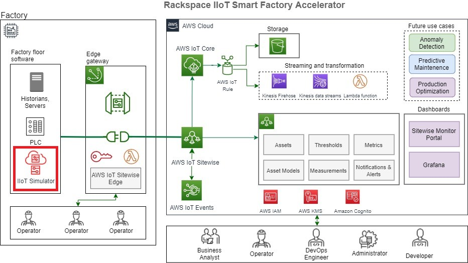
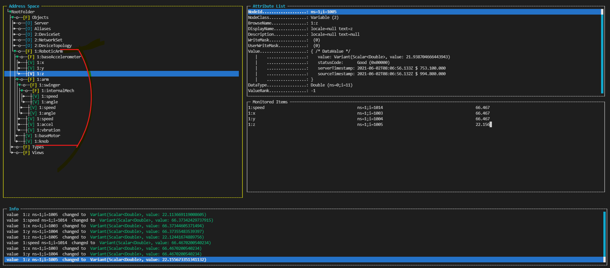

# Rackspace IIoT Smart Factory Simulator





## Purpose
The idea behind the **Rackspace IIoT Smart Factory Simulator** is to help with the demos and initial parts of the engagement where we would like to ingest data from an OPC UA Server as a data source.  Most often it so happens that we might not get access to the Customer factory floor servers and might have to rely on mocking up the data. This simulator helps to mock up an OPC UA address space and data of the customer so that the team is not blocked receiving data from those servers. Once the simulator is up and running, it can act as an OPC UA source for the Sitewise connector. No OPC UA client is required to generate the data, the server itself generates the data based on a pre-defined function that can be configured at a node variable level in the desired sampling frequency.

## Getting started
The **Rackspace IIoT Smart Factory Simulator** is based on open source library [node-opcua](https://github.com/node-opcua/node-opcua). A minimal understanding of the OPC UA protocol is required to create or update the configuration of the simulator.

## Install & Run the simulator
```
npm i 
node server.js
```

## Features
The following are the features of the Simulator,

### 1. Protocols support


| Protocol  |    Supported?   |                 Notes                       |            
|-----------|-----------------|---------------------------------------------|
|  OPC UA   |       Y         | Basic browsing, data generation support     |
|  Modbus   |       N         | Plans to support in the future              |


### 2. Configuration
The configuration for the simulator is a JSON object that represents the hierarchy of the factory floor. It will 
typically be provided by the customer. Once the hierarchy is determined, it needs to be modelled in the way expected by the simulator. The format closely reflects an OPC UA information model and address space.

A Variable is modelled as below, you can find the schema definistions in the schemas folder.

```
{
    id: "/SimpleNodeVar",
    type: "object",
    properties :{
        nodeId: {"type": "string"},
        minimumSamplingInterval: {"type": "integer"},
        browseName: {"type": "string"},
        dataType : {
            "type": "string",
            "enum": ["Integer","Double"]
        },
        getFunc: {"type":"str"}
    },
    required: ["nodeId","browseName","dataType","minimumSamplingInterval","getFunc"]
}
```

and an Object is modelled as below,

```
{
    id: "/SimpleNodeObj",
    type: "object",
    properties :{
        nodeId: {"type": "string"},
        browseName: {"type": "string"},
        "list": 
        {
            type: "array",
            items: {
            anyOf: [{"$ref":"/SimpleNodeVar"},{"$ref":"/SimpleNodeObj"}]
            }
        }
    },
    required: ["nodeId","browseName"]
}
```
An Object is a container or folder which can in turn hold more Objects and Variables, and hence is suitable to model a multi-level hierarchy. [jsonschema](https://www.npmjs.com/package/jsonschema) library is used to validate the Configuration object against the above schema.

There are some default mock ups in the config folder that can be used as a start. The schema is validated before the address space is condtructed in the server. Please look at the schema to better understand what are the mandatory fields required for a NodeVariable and a NodeObject. 

As different variables will have different sampling intervals and patterns of data generated. The simulator also provides a way to add custom functions at a variable level. The configuration of the SimpleNodeVar schema involves a **getFunc** attribute, which is the name of a function you would like to invoke to generate data at the **minimumSamplingInterval**. The developer is free to use any entropy source available. These functions are stateless in nature and are defined [here](./functions.js).


### 3. Building the configuration programatically
The simulator also provides an API to programatically build the config. This is useful if you want to 
build the configuration from a csv file export or some other input. 

tools/config-builder.js provides an example,

```javascript
import {NodeObj,NodeVar} from '../config/classes/node-classes.js'

var myNodeObj;
myNodeObj = new NodeObj("MyFactoryDevices","MyFactoryDevicesId")
myNodeObj.addNode(new NodeVar("ConveyorSpeed","ConveyorSpeedId",1000,"Double","generate_sequence_double_30"))
myNodeObj.addNode(new NodeVar("MotorCurrent","MotorCurrentId",500,"Double","generate_sequence_double"))
myNodeObj.addNode(new NodeVar("MotorRpm","MotorRpmId",100,"Double","generate_sequence_double"))
console.log(JSON.stringify(myNodeObj, null, 4))

```
The above lines of code produces the following output.

```json
{
    "browseName": "MyFactoryDevices",
    "nodeId": "MyFactoryDevicesId",
    "list": [
        {
            "browseName": "ConveyorSpeed",
            "nodeId": "ConveyorSpeedId",
            "minimumSamplingInterval": 1000,        
            "dataType": "Double",
            "getFunc": "generate_sequence_double_30"
        },
        {
            "browseName": "MotorCurrent",
            "nodeId": "MotorCurrentId",
            "minimumSamplingInterval": 500,
            "dataType": "Double",
            "getFunc": "generate_sequence_double"   
        },
        {
            "browseName": "MotorRpm",
            "nodeId": "MotorRpmId",
            "minimumSamplingInterval": 100,
            "dataType": "Double",
            "getFunc": "generate_sequence_double"
        }
    ]
}
```
### 4. Verification 
Once the configuration has been created and the server is launched, you could verify the OPC UA Server address space and data by using an OPC UA client and simply browse the address space under Objects folder of the Server.

```
npm install opcua-commander -g
opcua-commander -e [server url with port]
Example: opcua-commander -e opc.tcp://localhost:44500
```

The robotic arm mock up will produce a hierarchy as highlighted in red in the below image:

